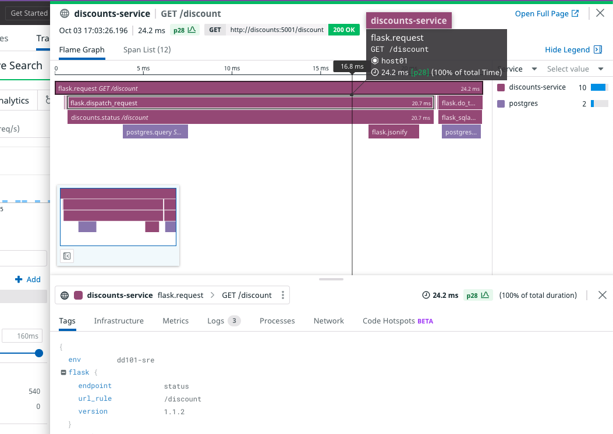

# 🐶 Datadog - Studies

[Docs.](https://docs.datadoghq.com/)

Datadog is an observability platform for cloud-scale apps, providing monitoring of servers, databases, tools, and services, through a SaaS-based data analytics platform. 

In the image below, it is possible to see the 3 pillars of observability in Datadog.

<div align="center">
  
   <p><em>Datadog Overview</em></p>
</div>

# Introduction to Observability

## 3 Pillars of Observability

1. Metrics:
These data points are numerical values that can track anything about your environment over time

2. Logs:
A computer generated file that contains time stamped information about the usage of that system

3. Traces:
Used to track the time spent by an application processing a request and the status of this request 

## Metrics

Metrics are numerical values that can track anything about your environment over time, from latency to error rates to user signups. 

<div align="center">
  
     <p><em>Metrics</em></p>

  
   <p><em>Datadog Metrics</em></p>
</div>

Metrics make more sense when we graph them over time. This allows us to clearly identify patterns in our data. In this way, we can distinguish between what is normal and what is abnormal.

### Reasons to Collect Metrics: 

- Baseline for Operations: 
Metrics can tell us what normal looks like for our apps. Without metrics, we're stuck guessing what's going on.

- Reactive Responses:
Using metrics we don't have to wait until a customer reports an outage. We can react to issues in our environment before they snowball. 

- Proactive Responses: 
Why wait for something to go wrong? By looking at metrics we can get ahead of problems before they happen. 

### Why does this matter?

- Wake up less for on call
- Less fire drills
- Reduced costs
- Happier customers 
- Less tickets
- Happier boss

## Monitoring 

Monitoring is the act of paying attention to the patterns that your metrics are telling you. It's about analyzing your data and acting on it. 

### What do we Monitor?

1. Performance
- By watching performance we can watch how our architecture and apps are using the resources that are available
- CPU, disk, memory...

2. Security
- Is something going wrong in our environment? Creating monitors around security metrics can stop incidents in their tracks  
- Anomalies, sign-ins from unauthorized locations, and ensure data is securely stored.

3. Usage 
- What are our users doing in our environment? Are they interacting with our products? 

## Alerting

Alerts are simply setting a threshold in a monitor. When that threshold is breached, a notification is sent to the designated recipient. 

### Alert Fatigue 

Alert fatigue arises from over alerting. It's important to only alert team member when something actionable needs to be done. 
**If everything is an emergency, nothing is an emergency.**

## Logs 

A log is a computer generated file that contains information regarding the usage of a system. This gives you insight into the behavior of the resource. 

### Why do we collect logs? 

1. Compliance
- Standards that the business is held to might dictate which logs you'll need to store and for how long you need to store them. 

2. Insight 
- Logs can give you insight into apps and system performance that metrics by themselves might not be able to provide.

3. Security
- This is a priority for businesses. Logs are needed to demonstrate that only authorized activities are going on inside of a system. 

### Practical uses for Logs

- Troubleshooting
- Auditing 
- Monitoring 
- Alerting
- Personal History 
- Not getting in trouble 

### Storing our Logs 

**What kind of services generate logs?**
- Servers
- Serverless Functions
- Web Browsers
- Mobile/IoT Devices
- Containers 
- Cloud Services

### How long do we store Logs? - Log Storage

Three guiding principles when determining how long we want to store our logs:

1. **Compliance:** Standards that the business is held to might dictate how long your logs need to be stored.
2. **Usefulness:** Some logs are more helpful than others. It's up to you to decide which logs need to be stored for whatever length of time is useful to you.
3. **Cost:** Storage costs money. Depending on the services you're using, you'll want to keep in mind your budget when deciding on storage length.

In Datadog from logs we can create metrics, alarms, archives, etc.

## Traces and Spans

- A trace is used to track the time spent by an app processing a request long with the execution path taken. 
A trace can also be defined as the entire journey including all of the stops along the way.

- A span is the individual unit of work that the code is doing.


### Why do we collect traces?

1. **Microservices:** as business migrate away from Monolithic architecture, tracing is needed to figure out what all of the microservices are up to. 
2. **Optimization:** tracing allows you to optimize the performance of your apps by identifying bottlenecks in the calls being made.
3. **Troubleshooting:** when something goes wrong, we need insight into the actual app code. 

#### Topics overview of 'Datadog Foundation'
**Universal** Service Monitoring (USM) provides a comprehensive overview of service health metrics across your technology stack without requiring you to instrument your code.

**Logs** capture event streams from various components of your infrastructure. Datadog Log Management enables you to cost-effectively collect, process, archive, explore, and monitor all your logs.

**Metrics** can track a wide range of measurements—such as latencies, error rates, or even user signups—within your environment over time. Monitors actively check on these metrics and alert you when critical changes occur, for example, when a threshold indicating a problem is crossed. You can use either metrics or monitors as the basis for service level objectives (SLOs), which define targets for performance and provide a framework for establishing clear standards for service quality.

**Integrations** are plugins or add-ons that enable Datadog to monitor individual third-party software, services, or tools. With the help of integrations, Datadog can unify different metrics and logs generated by many technologies deployed across your infrastructure.

**Dashboards** allow you to view curated visualizations of key observability data on a single page. You can create custom dashboards from scratch, but there are also many out-of-the-box (OOTB) or pre-built dashboards available.

# Datadog Foundation

## Universal Service Monitoring - USM

USM offers a view of surface health metrics across your entire technology stack without the need to instrument your code. Instead, it relies on the presence of a configured Datadog agent and universal service tagging to collect data about your existing services, which can then be viewed through the service catalog. 

### Enabling USM requires the following: 

- If on Linux, your service must be running in a container.
- If on Windows and using IIS, your service must be running on a virtual marchine.
- The Datadog Agent needs to be installed alongside your service. 
- The env tag for Unified Service Tagging must be applied to your deployment. 

## Unified Service Tagging 

USM is capable of identifying services through commonly used container tags, such as app, short image and container name. And automatically generates corresponding entries in the service catalog. Once these services are covered, Datadog enables you to access request, access, error and duration metrics for both inbound and outbound traffic. 

These service health metrics are helpful in setting up alerts, tracking deployments, and establishing service level objectives (SLOs), providing you with a comprehensive view of all the services running on your infrastructure.

The Service Catalog in Datadog is a centralized place to view all services in your application. Service Catalog automatically includes services detected by USM. Developers and site reliability engineers can view all services, their structures, and links to more information. It improves the on-call experience for everyone by establishing correct ownership information and communication channels, alongside easy access to monitoring and troubleshooting details. In case of an incident, it can speed up recovery by increasing confidence and making it simpler to locate owners of upstream and downstream services and dependencies.

## LAB: USM and Service Catalog 

[docker-compose.yml](./docker-compose.yml) example of how the Agent was configured to enable USM

The first service listed, ``datadog``, is the Datadog Agent. The Agent monitors other containers and the Docker host to collect USM data.

On line 17, this environment variable enables USM in the Agent:

``DD_SYSTEM_PROBE_SERVICE_MONITORING_ENABLED=true``

Locate line 25. This is the start of a list of files on the Docker host that are mounted as volumes in the Agent container. The Agent will access these files to build a comprehensive picture of the services running on the Docker host.

Locate line 41, which defines the extra capabilities granted to the Agent container. These are required because the Agent uses eBPF for most of its data gathering, which operates at the kernel level.

Docker-compose is orchestrating Storedog in this lab, but USM can be enabled almost anywhere the Agent can run. See the USM documentation to learn about USM in other environments.

#### The Services
Services that you want to appear in Service Catalog should have unified service tags. These are three tags that the Agent will look for to help identify services:

``service``, the name of the services, such as ``store-ads``
``env``, the environment in which the services is running. For example, ``production``, ``internal``, ``foundation-lab``
``version``, a number such as ``1 or 1.2.3``
If services are running in containers, they are tagged using labels.

In docker-compose.yml, locate line 104, which defines the container labels for the ``store-frontend`` service:

````
labels:
   com.datadoghq.ad.logs: '[{"source": "nodejs", "service": "store-frontend"}]'
   com.datadoghq.tags.env: '${DD_ENV}'
   com.datadoghq.tags.service: 'store-frontend'
   com.datadoghq.tags.version: '1.0.10'
   my.custom.label.team: 'frontend'
```` 

You can see the ``com.datadoghq.tags.*`` labels that comprise the unified service tags for this service. ``env`` is set to ``${DD_ENV}``, an environment from the Docker host that is set to ``foundation-lab``.

Find other unified service tags in docker-compose.yml. Notice that the value for ``service`` is the name that Universal Service Monitoring uses to identify the service, and that's what is displayed in Service Catalog.

## Logs 

Datadog Log Management allows you to cost-effectively collect, process, *archive, explore, and monitor all your logs without limitations.

### Datadog Log Management:

- You can collect logs from various sources, such as hosts, containers, and cloud providers.
- Once the logs are ingested, you can enhance them using pipelines and processors, create metrics from the logs, and manage storage-optimized archives with Log Configuration options.
- You can connect logs to metrics and traces from other sources for greater insights.
- Finally, you can search, filter, and query the ingested logs in the Log Explorer.

### Log Explorer 

The Log Explorer is your central hub for investigating and exploring logs. You can browse logs, search for specific words, filter many log lines to show only the lines you’re interested in, group content, visualize patterns, and export logs.

A search query in Log Explorer is composed of terms (either a single word or a group of words surrounded by double quotes) and Boolean operators. You can also filter logs using log facets, which are user-defined tags and attributes from your indexed logs, which are logs that have been collected, processed, and retained for analysis, alerting, and troubleshooting.

Logs can be valuable as individual events, but sometimes valuable information lives in a subset of events. In order to get this information, you can group your logs into fields, patterns, and transactions.

To better visualize the results of the filtered and aggregated logs, you can choose different visualizations to surface crucial information. For example, you can arrange your log data into columns by viewing them as a list, or track changes in your log data over time by observing them in a timeseries. Other visualizations include top list, nested tables, pie charts, and a tree map.

#### Notas:

To see logs in real time: 
1. Logs
2. Explorer
3. Time field (ex.: Past 15 min.) change to Live Tail

Search bar:
Under the search bar, there are options to group the logs into fields, patterns, or transactions, and to visualize the logs as a list, timeseries, top list, table, tree map, or pie chart.

1. In the search bar, start typing service:store-frontend, and the search bar's autocomplete feature will provide values to complete your query.

2. When it appears, select store-frontend in the autocomplete list to view all the logs from the store-frontend service.

3. Next to Group into, click on Fields to group logs by fields.

4. When aggregating indexed logs by fields, all logs matching your query filter are aggregated into groups based on the value of one or more log facets.

5. Next to Show Count of, click on all logs if it is not already selected. Here you could alternatively filter results by selecting various available measures, such as the count of unique values for a particular facet (for example, Service), or statistical operations on numerical values of a facet (for example, Duration).

Search for all the logs originating from a file using that filename attribute:
- Filter by ``@filename:ads.py``

Filter using text strings from log messages:
- In the search bar, enter the following, making sure to include the double quotes " around the text string:
``"Total advertisements available"``

Facets:
Common tags and attributes automatically appear in the facet panel as Datadog parses logs. Facets are useful for qualitative or quantitative data analysis, so you can use them to search through logs, define log patterns, and perform log analytics. Although the automatically generated facets are helpful, you might also want to create your own custom facet that appears in the facet panel. You can accomplish this with the help of the log details in the log side panel.

1. In the list of store-discounts logs that have "influencer specific discounts" in the log message, click one of the log lines to open the log side panel.

2. Under Event Attributes, for the process attribute, click on name and select Create facet for @process.name from the popup menu.

3. The Add facet popup dialog will appear. You can expand Advanced if you want to view the additional fields.

4. Click Add.

5. You'll see a message confirming that the facet has been successfully added.

6. Close the logs side panel and clear the search bar at the top of the page.

7. Scroll to the bottom of the facet panel. Under the OTHERS facet group, expand the process.name facet.

Log Aggregation:
With field aggregation, all logs matching the query filter are split into groups (i.e., aggregated) based on the different values of a specified log facet. Aggregating or grouping logs this way can help you see trends more clearly and visualize relationships between different types of log facets.

It would likely be even more useful if you could see the logs grouped, for example, by Service.

Next to by, change Everything to Service (service) to group by service.

Export graphs
You can export any logs visualization to other areas of Datadog. You can even create a custom metric from logs or download aggregated data as a CSV.

1. Change the visualization back to Timeseries.

2. Click the Save to Dashboard button above the graph.

Note: If you click on the More button next to it, you can see the different ways to export the logs.

3. In the Export graph popup dialog, click the New Dashboard link.

4. Export graph dialog with New Dashboard highlighted.

5. A notice at the top of the page contains a link to the new dashboard.

6. Click the link if you want to see the dashboard.

## Metrics: 

Metrics are the smallest unit in the Datadog universe but they grant enormous insight into your infrastructure when they are visualized, measured, and monitored. Metrics are numerical measurements about any aspect of your system over a period of time, such as latency, error rates, or user registrations. In Datadog, metric data is received and retained as data points that include a value and timestamp.

Monitors send notifications when metrics fall outside of the tolerances that you define.

Service Level Objectives track metrics over long periods of time to help you define quality standards.

Sending metrics to Datadog
Metrics can be sent to Datadog from several sources:

The Datadog Agent automatically sends many standard metrics, such as ``avg:system.cpu.user: 18.63`` or ``system.disk.read_time: 42``.

Metrics can be generated within the Datadog platform.
You can create custom metrics related to your business and submit them through the Agent, DogStatsD, or the HTTP API.

#### Metric types
Datadog offers metric types that apply to specific purposes: count, rate, gauge, histogram, and distribution. These metric types determine the available graphs and functions that can be utilized with the metric within Datadog.

[Docs Metric Types](https://docs.datadoghq.com/metrics/types/?tab=count)

- Count: Adds up the values received within a specified time interval. For example, 2000 HTTP requests.

- Rate: Divides the count by the duration of the time interval. Using the same example mentioned above, 0.566 HTTP requests per second.

- Gauge: Reports the last value received during the specific time interval. This metric type would be appropriate for monitoring the usage of RAM or CPU, since the last value gives an accurate representation of the host’s behavior during the timeframe: 2097152 bytes of RAM.

- Histogram: Summarizes the submitted values into five different values: the mean, count, median, 95th percentile, and maximum. This generates five distinct timeseries. For example, this metric type is useful for measuring latency, where it is inadequate to only know the average value. Histograms enable you to understand how the data is distributed without recording every single data point.

- Distribution: Summarizes the values submitted within a time interval across all the hosts in your environment. Distributions provide enhanced query functionality and configuration options that aren’t offered with other metric types.

### Metrics Explorer
Once you have metrics in Datadog, you can examine them using the Metrics Explorer. You can customize the graph shown on the Metrics Explorer page by using the query editor. You can also search for tag values to define a filtering scope or select a space aggregation method (such as, average, max, min, sum) to combine metric values. Additionally, the function button can be used to add functions to your query.

### Monitors
It’s a Tuesday afternoon and global web hosting company ABC has a major outage in region jupiter-east-1. You happen to be staring at your Datadog dashboard at the exact moment when the outage begins. But what if you aren’t?

Monitors will continuously check metrics, integration availability, network endpoints, and other vital aspects for conditions that you define. When a threshold is exceeded, Datadog will notify you or your team on the Datadog mobile app, by email, or on your chat platform. This capability is essential for complete infrastructure visibility in one centralized location.

Datadog offers a variety of monitors to cater to different monitoring needs. Some of the most popular types of monitors include:

- Metric monitors: Used to track and alert on specific metrics. This type of monitor is commonly used to track things like server CPU usage, memory utilization, or network bandwidth. For example, Send a notification to the DevOps team if average HTTP response time exceeds 1.50 seconds.

- Service Checks: Used to verify the status and availability of various services, such as databases or APIs. Service Checks can be used to monitor both external and internal services. For example, is the redis service healthy?

- APM monitors: Used to monitor application performance, track errors, and measure latency. This monitor provides insights into how applications are executing and helps to identify potential issues. For example, alert the development team with an application’s Errors per second is above 25.

- Synthetics monitors: Used to monitor critical user flows and business transactions. Synthetic API tests and browser tests help you proactively identify issues in application endpoints and key business workflows before your end users encounter them. Synthetics monitors can simulate user actions, such as logging in or adding an item to a shopping cart, and alert you if there are any errors or delays.

- Log monitors: Used to monitor specific keywords or patterns in log data. Log monitors can track security issues, application errors, or system events.

These monitors can be customized. You can create Service Level Objectives from them, too.

### Service Level Objective (SLO)
Service Level Indicators (SLIs) are metrics that are used to measure some aspect of the level of service that is being provided. For example, 10 errors per second on the storedog-payments service. SLIs that are vital to your organization’s success can be monitored over time as Service Level Objectives (SLO). Tracking these metrics as SLOs establishes clear targets for service quality, enabling you to measure progress and make improvements over time. For example, the service has an SLO of 99% of requests being successful over the past 7 days or less than 1 second latency 99% of the time over the past 30 days.

This approach enables site reliability engineers, frontend developers, and even product managers to maintain a consistent customer experience, balance feature development with platform stability, and enhance communication with both internal and external users. Your team will be focused on the metrics that matter most and you’ll be consistently delivering a high level of service to your customers. In essence, SLOs provide a roadmap for defining, measuring, and improving service quality, ultimately leading to a more robust and reliable system.

### Metrics Summary - Notes
The Metrics Summary page shows all metrics reporting across your infrastructure.

#### Facet panel
To the left of the metrics list, there is a facet panel. You can filter your metrics by Configuration, Percentiles, Metric Type, and Distribution Metric Origin.

- Configuration allows you to identify metrics with tag configurations or additional percentile aggregations.

- Percentiles shows you which distributions have percentiles enabled.

- Metric Type helps you identify distributions and non-distributions (counts, gauges, and rates).

- Distribution Metric Origin quickly identifies which Datadog component the distribution metrics have originated from.

#### Metric details side panel
The side panel will show you details about the metric, such as the number of distinct metrics reported, the number of hosts reporting a metric, and the number of tag values attached to a metric. You will also see metadata attached to your metric as well as a Tags table.

#### Search bar
While facets are helpful to quickly filter the metrics, search bars provide the most comprehensive set of capabilities to filter the list of metrics.

You can search your metrics by metric name or tag using the Metric or Tag search fields at the top of the page.

#### Query editor
Near the top of the Metrics Explorer page, there is a query editor that you can use to customize graphs.

#### Visualization options
Take some time to examine the graphs and explore the visualization options available to customize your graphs.

Under the query editor, notice the drop down menus for Display, Color, Style, and Stroke.

#### Export to dashboard
When you click the Save to Dashboard button, a popup modal will ask you to select a dashboard to export the graph to.

1. Select the New Dashboard link to create a new dashboard with this graph.

2. Navigate to Dashboards > Dashboard List.

3. Click the new dashboard at the top of the list that has your current date and time printed on it.

note: You can also create this graph as a widget directly in the dashboard from scratch and get the same result.

### Searching, filtering, and visualizing metrics in graphs makes it easy to spot issues. But you can't watch these graphs all day to see if something goes wrong.

That's where monitors come in handy. Monitors can actively check metrics, integration availability, network endpoints, and more.

Create a monitor that will alert your team when the ``trace.flask.request`` metric is above the threshold of 2 seconds for the ``store-discounts`` service.

1. Navigate to Monitors > New Monitor.

2. Notice all the types of monitors Datadog provides. You can hover over each type to view its summary.

3. Click Metric to create a new metric-based monitor.

4. In the top right corner, change the timeframe to Past 1 Hour.

5. For Choose the detection method, keep the default value of Threshold Alert. An alert will be triggered when a metric crosses the threshold that you set.

6. For Define the metric, in the metric field, type ``trace.flask.request`` and in the From field, type ``service:store-discounts``.

7. Define the alert and warning thresholds.

For Set alert conditions, set Alert threshold to 2, and Warning threshold to 1.5.

8. Under Notify your team, you can name your monitor and set up a monitor alert message.

9. For the Monitor Message, write a simple message letting others know what to look for, who to notify, and other helpful information. Try writing your own message, or feel free to use the message below:

```` 
Investigate the source of the problem. Try checking the [APM service page](https://app.datadoghq.com/apm/services/store-discounts/operations/flask.request?env=foundation-lab&start=1684155366000&end=1684158966000&paused=false) for `store-discounts`.

Contact @incident@example.com after triage.
```` 

Note: The @ symbol preceding email addresses will render as a link to that user's Datadog profile if they are part of your organization. In this activity, the referenced user (incident@example.com) does not exist, but if you'd like to see how the notification emails are sent out, feel free to add your own email address.

You can learn more about the special syntax features of the notification text area in the Notifications docs. These docs also cover powerful notifications-based capabilities enabled by the Datadog integrations for Slack, PagerDuty, and Webhooks—with others possible in the future.

10. For the purpose of this activity, leave the rest of the default settings how they are. And Create.

The newly created monitor will take a few minutes before any data appears, so examine the monitor interface while you wait.

#

At the top of the page, next to the monitor title, is the monitor status. A monitor can be in OK, Warn, Alert, or No Data states, based on whether associated data is surpassing Monitor thresholds (or not reporting at all).

On the right, there are the Mute, Escalate (and Resolve if your monitor is in an alert state), and the settings cog buttons.

The Mute button can be used to mute the entire monitor or partially mute it by setting a scope.

The Escalate drop-down menu has options to create a case or declare an incident.

If your monitor is in an alert state, you will see a Resolve button that will allow you to resolve your monitor manually.

The Properties section gives you an overview of the monitor's status, type, ID, date created, author, tags, query, recipient, and message.

Note: The monitor is an APM Monitor because the trace.flask.request metric is a distribution metric that originates from APM.

The Status & History section displays the status graph that shows your monitor's status over time, along with the history graph and the evaluation graph.

The Events section shows you the events generated from your monitor, such as when the alert was triggered or recovered.

Note: You can use conditional variables to display different messages depending on the status of the monitor or the details relating to how it was triggered.

## SLO
SLOs enable you to set clear performance targets for a delivered service, product, or application—and then measure how well you are meeting these targets over time. In Datadog, you use SLOs to determine whether a performance measurement (or set of measurements) has been meeting a minimum threshold for a target percentage of time (by default, 99.9%) over a rolling time window of 7, 30, or 90 days. This capability lets you track how well your organization is meeting its service obligations with its external customers or internal end users.

A good example of an SLO might be, "The discounts service should be running 99.9% of the time for any 7-day period."

Now that you have a monitor on the discounts service request time, you can use that as the Service Level Indicator (SLI) for a new SLO.

Navigate to Service Mgmt > Services > SLOs.

At the top right corner, click the New SLO button.

Under Select how to measure your SLO, select By Monitor Uptime.

From the Select monitors drop-down menu, select the Discounts service request time monitor.

Under Set your target & time window, leave the default values of 99.9% over 7 days.

Under Add name and tags, set Name to the following: ``SLO: Discounts service request time``

Click Create and Set Alert. This will bring you to the new SLO monitor settings page.

Notice under Select SLO, your SLO has already been selected.

For Set alert conditions, leave the default values for Error Budget. You will be alerted when 100% of the budget for a 7-day target is consumed.

Under Notify Your Team, name the monitor: ``SLO: Discounts service request time``

## Integrations: 

The Datadog Agent is software that runs on your hosts. It collects process- level events and metrics and sends them to Datadog, where you can analyze your monitoring and performance data. For this course, the Datadog Agent has already been installed for you in all the labs.

Every organization has its own, unique infrastructure. For the most part, the Datadog Agent’s default core integrations cover the most common attributes of these infrastructures—disk, CPU, memory, network throughput, etc. However, it’s possible to tailor Datadog to your specific infrastructure by either utilizing community integrations or creating your integration.

There are three main types of integrations: Agent-based, authentication-based, and library. You can even build your own integration!

- **Agent-based integrations** are installed with the Datadog Agent (on your host or in containers) and use a Python class method called check to define the metrics to collect.

- **Authentication (crawler) based integrations** are set up in Datadog where you provide credentials to obtain metrics and data from APIs. These include popular integrations like Slack, AWS, Azure, and PagerDuty.

- **Library integrations** use the Datadog API to allow you to monitor applications based on the language they’re written in, like Node.js or Python.

The Agent-based and authentication-based integrations offer an array of new metrics and pre-configured dashboards, whereas library integrations are imported into your application code to monitor your application logs, traces, and custom metrics. All the integrations and instructions for installing them are easily accessible in the Datadog app.

#### Check Status

A few system checks are among the dozens of integrations that ship with the Agent. They provide metrics from your base system about the CPU, IO, load, memory, swap, and uptime.

You can see these checks running in your lab right now: ``docker compose exec datadog agent status``
This command told your container orchestrator, docker compose, to execute the agent status command in the datadog service container. 


Look at information supplied in the disk check. If you're getting tired of scrolling, use this command instead: ``docker compose exec datadog agent status | grep '^\s*disk' -A 11``

Next to Instance ID, you can see the check's health. In this case, [OK].

Further down is Total Runs, which is the number times that the Agent has run this check since the Agent started.

You can also see the number of Metric Samples collected during the last check and a running total of those samples since the Agent started.

Finally, you can also see Average Execution Time, Last Execution Date, and the Last Successful Execution Date, which are all useful for troubleshooting.

By default, the Disk integration doesn't perform Service Checks or emit any Events, though many integrations do.

Also, the Agent doesn't persist any of this information. If the Agent restarts, any totals and averages are reset.

#### Run a check

The Agent automatically runs system integration checks every 15 seconds. You can also run a check manually. This is something you might do while troubleshooting or developing your own check, because it also prints a lot of diagnostic information. Command: ``docker compose exec datadog agent check disk``

Like the previous command you ran, this runs a command in the datadog container. This time, the command is agent check disk.

You will see hundreds of lines of output, comprising all the samples the Agent collected when running that check.

You'll also see a summary of the disk check specifically. This summary resembles the disk check summary in the status command output.

Scroll up to find the last “metric” output by the check command. It will be between {} brackets, as displayed in the following screenshot:

Note: Your output will likely be different than the output in the screenshot. Instructions below will refer to the screenshot, but be sure to inspect your own output, too.

Looking at the system.disk.in_use metric in the screenshot, find the points value.

Each point consists of a timestamp and a value. Here, there is one point, with the values 1681167901 and 1.

All the Datadog integrations—including Agent, authentication, and library types—are covered in [Datadog Integration Docs](https://docs.datadoghq.com/integrations/)

#### Intro. 
To the Agent, an integration is simply another Python check function that collects metrics, events, logs, and service checks. In Datadog, an integration can also provide out-of-the-box (OOTB) dashboards, special log processing rules called pipelines, and other resources.

Navigate to the Integrations page by hovering over Integrations (the puzzle piece icon) in the global navigation. From the resulting menu, click Integrations again.

Integrations on this page are displayed as tiles, and they are grouped into three categories: Autodetected Integrations, Installed, and Available.

**Autodetected** Integrations have been detected by the Agent but haven't been configured yet.

**Installed** integrations have been detected by the Agent and do not require configuration.

**Available** integrations are everything else, including non-Agent integrations, which you'll learn about in the next activity.

Generally, if the Agent is successfully running an integration's check, and if that integration comes with OOTB dashboards, logs, or pipelines, you will see the integration listed here.

[Containerized Docker Agent documentation](https://docs.datadoghq.com/containers/docker/?tab=standard#setup)

### Authentication integrations 
There are two common methods that authentication integrations use to get third-party data into your Datadog account:

1. Datadog can use an API key, token, or other credentials for a third-party API to pull data into Datadog.
2. A third party can use a Datadog API key that you provide to push data into Datadog.

Datadog pulls from third party
The CircleCI integration is an example of an integration that pulls data from a third-party API. Take a look at how it's configured.

1. In Datadog, navigate to Integrations by hovering over the puzzle piece icon, and selecting Integrations.

2. In the search field, enter ``circleci``.   

3. Click the tile tagged with ``Integration`` (not ``Software License``) to open the integration details panel.

4. Click the Configuration tab and read the instructions.

To connect to CircleCI, you would log in to your CircleCI account and generate an API token for Datadog.

5. Click the Add Account button.

This is where you would paste that API key, and optionally give its related repository a name.

#### Library Integrations
The third type of Datadog integration is client libraries. These integrations are open-source code packages that are imported directly into application code. These libraries make it easy for developers to send traces and profiling data to Datadog through the Agent for application performance monitoring (APM).

Storedog, the ecommerce application that is running in the lab, is served by several services—some of which are written in Ruby, and others in Python. There are Datadog libraries for each of these languages, and Storedog is already fully instrumented with them.

Installing libraries
Datadog provides a wizard to help you install libraries into your code in a variety of contexts.

1. In Datadog, navigate to APM > Services > Add a Service.

2. On the left, click Container-Based, as all of Storedog is running in containers.

3. Click docker.

4. Click Same host.

5. Click python.

This displays instructions for instrumenting a Python application for this context, including a wizard to help you configure the container. 

## Dashboards: 

Dashboards display charts, tables, and notes about the data that you’ve sent to Datadog. With Dashboards, you can easily track and monitor critical metrics that are crucial to the health of your system. It is a central location for monitoring key data, making it easier to identify issues, detect trends, and take action to improve your application performance. Therefore, dashboards provide a clear and concise overview of your infrastructure, allowing you to quickly assess the state of your system and make informed decisions.

You can share these dashboards with people outside of Datadog. By sharing a dashboard through a URL or email link, others can view the contents of that dashboard in real-time, without any ability to modify the data.

Datadog offers a wide range of out-of-the-box dashboards that can help you get started quickly. For example, you could find a dashboard based on an integration you have added (such as Postgres or Docker) or a feature you use in your application (such as Real User Monitoring).

These dashboards can be cloned and customized to meet your specific needs, or you can even create your own dashboards from scratch. By leveraging these out-of-the-box dashboards, you can quickly get started with monitoring your infrastructure and applications and gain critical insights into system performance.

When you create your dashboard, there are three layout options to choose from: grid-based dashboards (the default), timeboards, and screenboards. For all these layouts, you can add images, graphs, and logs.

The grid-based dashboards are commonly used as status boards or storytelling views. These update in real-time and can represent fixed points in the past.

A screenboard layout is similar except that it’s free-form instead of a grid layout.

Timeboards provide an automatic layout and represent a single moment in time, whether fixed or real-time, for the entire dashboard. Those are often used for troubleshooting, correlation analysis, and general exploration of data.

### Widgets 
Datadog provides a wide range of widgets that can be used to create powerful and customized dashboards. Generic widgets graph data from Datadog products, while decoration widgets help visually structure and annotate dashboards. Some widely used widgets include:

- Timeseries: These allow you to visualize metric data over time.

<div align="center">
  
     <p><em>Metrics</em></p>
</div>

- Heat maps: These provide a color-coded view of your metrics aggregated across many tags, making it easy to identify patterns and trends.

<div align="center">
  
     <p><em>Metrics</em></p>
</div>

- Top lists: These show the top values for a metric, making it easy to quickly identify the most critical issues.

<div align="center">
  
     <p><em>Metrics</em></p>
</div>

- Event timelines: These show a timeline of events, making it easy to correlate system performance with changes or events.

<div align="center">
  
     <p><em>Metrics</em></p>
</div>

Overall, the choice of widget depends on the specific use case and the data being displayed. By leveraging the right combination of widgets, you can create powerful and informative dashboards that provide critical insights into system, service, and even business performance.

# Datadog 101: Site Reliability Engineer

## Application Performance Monitoring (APM)

Datadog Application Performance Monitoring (APM) provides end-to-end distributed tracing from frontend devices to applications, all the way to databases. By seamlessly correlating distributed traces with frontend and backend data, Datadog APM enables you to monitor service dependencies, reduce latency, and eliminate errors so that your users get the best possible experience.

Two important concepts of APM are traces and spans:

- A trace tracks the time spent by an application processing a request and the status of this request. Each trace consists of one or more spans.
- A span represents a logical unit of work in a distributed system for a given time period. Multiple spans construct a trace.

Datadog visualizes traces and spans in a flame graph:
<div align="center">
  
     <p><em>Metrics</em></p>
</div>

The flame graph above displays a trace containing 12 spans. Most of them are wide rectangles, and some of them are so small that they’re not easy to see without zooming in. The spans represent the units of work performed by the discounts service’s Flask application and the PostgreSQL database.

The topmost span of a trace represents the entire time the request took across all the spans below it. The x-axis of flame graph represents specific points in time, from the start of the trace to the end. When a span includes work from different parts of the application or infrastructure, that work is represented by smaller spans beneath it.

A summary of the above flame graph might be, “the discounts service’s ``/discount`` endpoint spent most of its time working on the request, resulting in two comparatively brief calls to the database.”

As an SRE, it’s likely that you won’t spend as much time poring over APM traces as an application developer might. But understanding how to read them at a high level can help you diagnose system problems. If you can isolate an issue to specific application areas, you can delegate further troubleshooting to the appropriate developers.

