# 🟠 Grafana - Studies

Download e Docs: 
- https://grafana.com/grafana/download?platform=windows
- https://grafana.com/docs/grafana/latest/ 
- https://grafana.com/docs/grafana/latest/cli/

## Pós-instalação

- A portal padrão do Grafana é a 3000, pra acessar o Grafana localmente é só ir no localhost:3000 e fazer login

- No primeiro login os acessos são:
 - user: admin 
 - senha: admin

# Users, organização, times e acessos

É possível agrupar usuários por organização e por times. 

Tudo isso é feito no painel **"Administration"**.

### Telas relevantes para administração de permissões e usuários:

  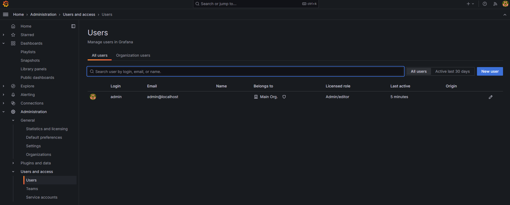
   
<em>Tela de Users</em>

  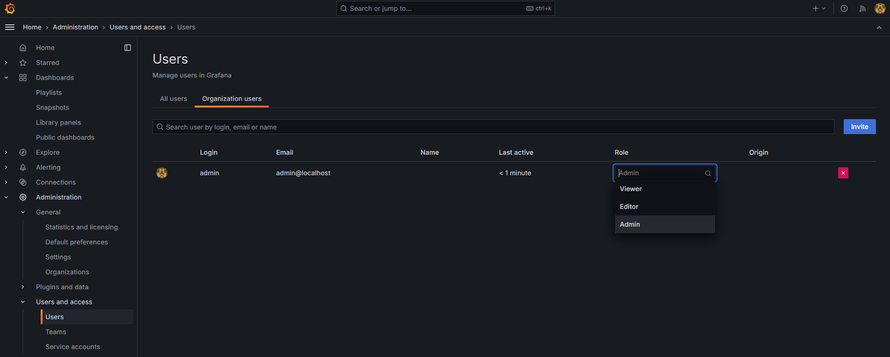
   
<em>Tela da Organização, onde se altera as roles também</em>

  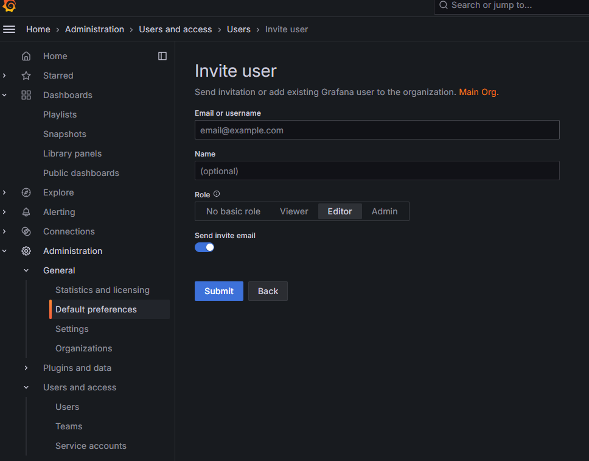
   
<em>Convidando user para a Organização</em>

  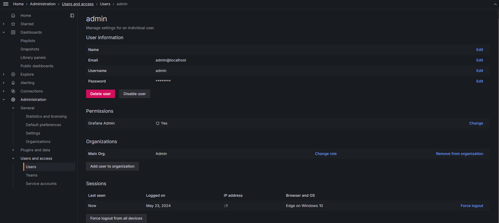
   
<em>Configurações de Users</em>

  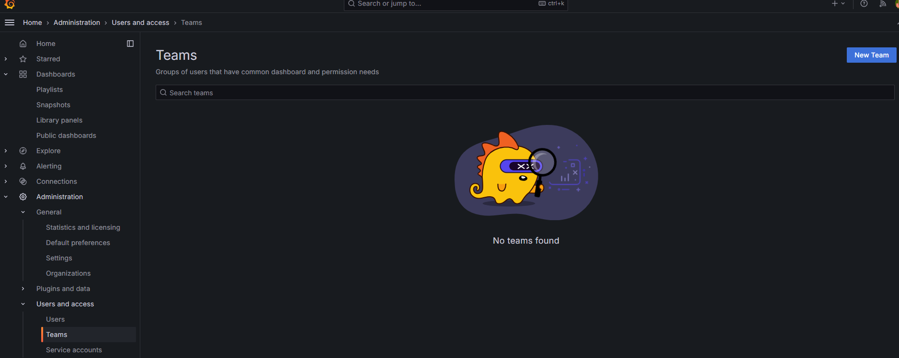
  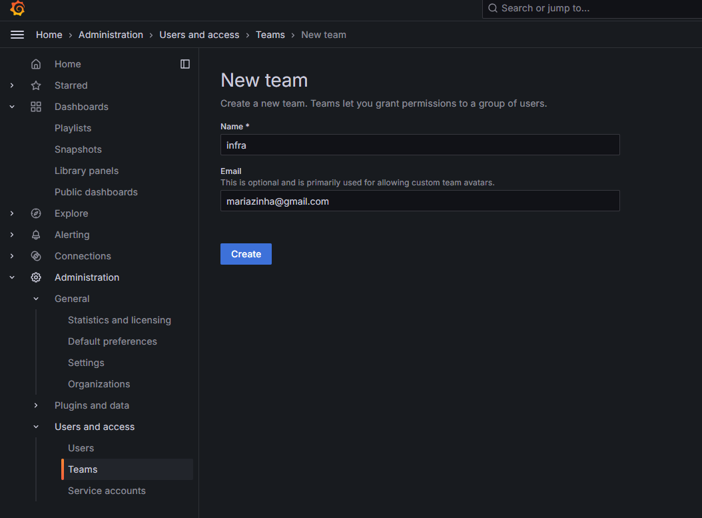
  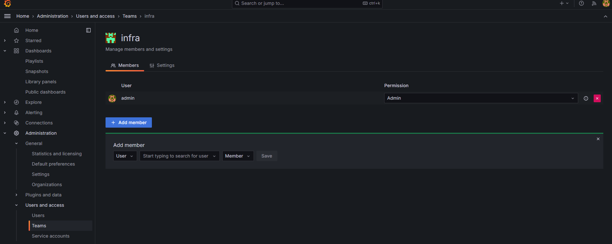

   
<em>Aba de Times, onde é possível criar, convidar os usuários e administrar times</em>

# Connections 

Nessa aba é possível adicionar conexões como PostgreSQL, Amazon Athena, MySQL, Redis, Azure Monitor, Azure DevOps, CloudWatch, Databricks, Datadog, etc. 

  
   
<em>Adicionando novas connections</em>

Em **Data sources** é possível visualizar essas conexões de fonte de dados.

  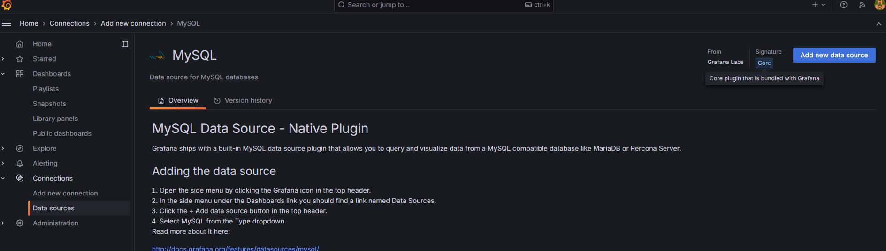
   
<em>Adicionando o MySQL como data source</em>

Por padrão a porta do MySQL é 3306, mas isso pode ser alterado durante a criação, junto com ajuste de autenticação, nome do bd, etc

  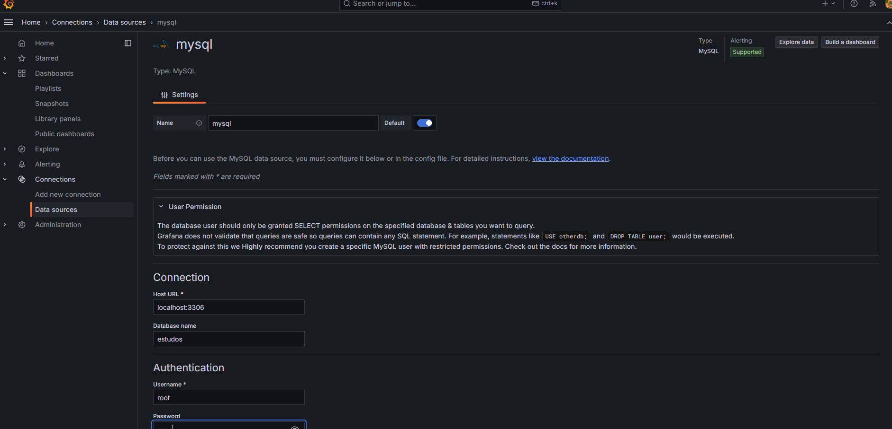
   
<em>Criando a conexão com o MySQL local</em>

Dessa forma, agora é possível ver a fonte de dados e criar dashboards para o banco

  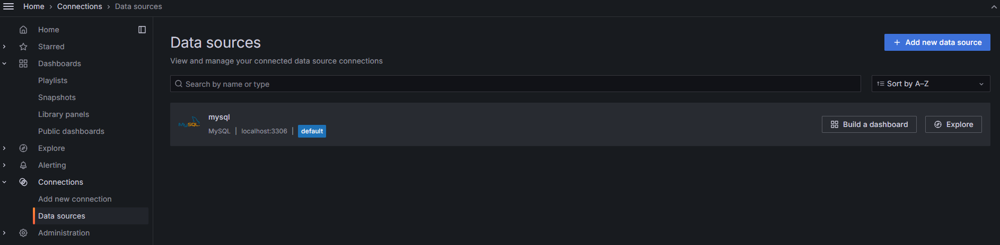

# Dashboards

Na aba de Dashboards é possível organizar por pastas ou só criar o painel direto.

Criei uma pasta chamada 'infra' para o Time 'infra', assim é possível dar permissão somente àquele time para a dashboard dos bancos que são responsabilidade daquele time. 

Nas configurações de permissões da pasta é possível alterar o nível de acesso, deletar, adicionar mais times/users/service accounts/role indo em "Folder actions -> Manage permissions"

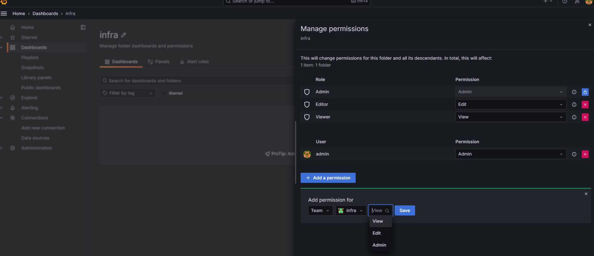

Dentro da pasta é possível criar a nova Dashboard pro banco local indo em "Add visualization"  

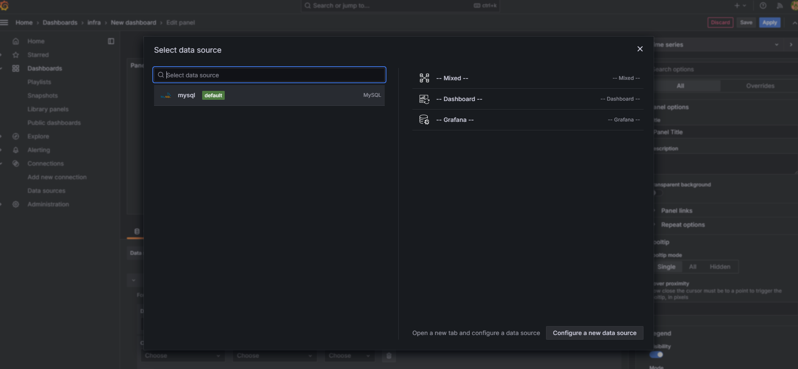

## Visualização e Consultas

Escolhendo um tipo de visualização para o banco em "Visualizations"

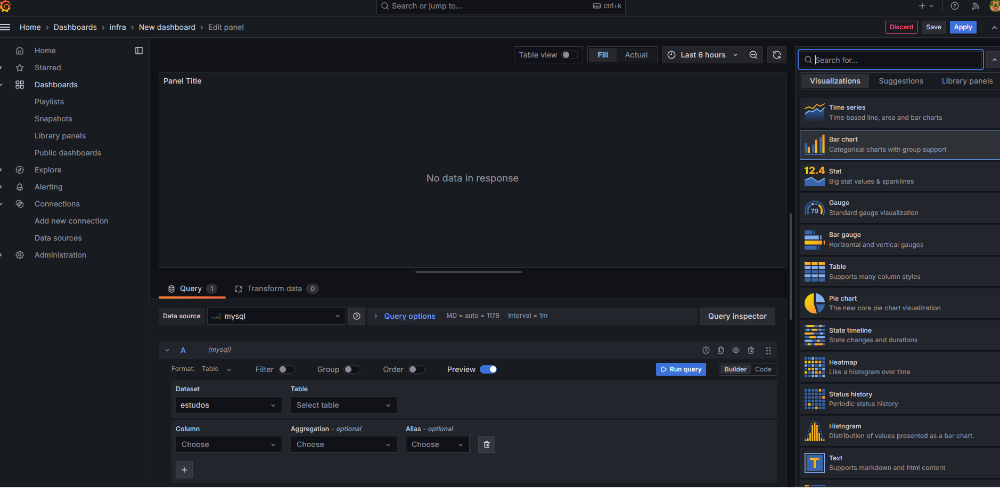

Na aba de "Query" é possível fazer consultas no banco. É possível fazer isso pela interface gráfica ou via código na opção "Code". 

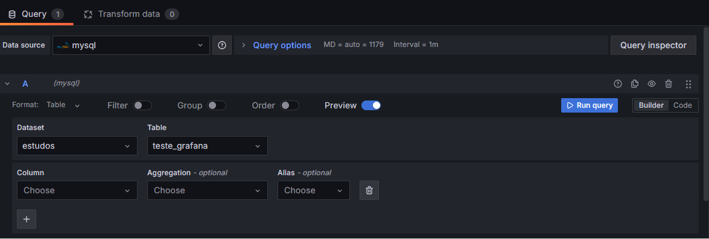

Ao fazer uma query, é possível visualizar o resultado com uma visualização adequada ao tipo de dado ou simplesmente na opção "Table view". É possível escolher várias colunas na interface na query e outras coisas para ter uma boa visualização do tratamento dos dados. 

Desativando a opção "Table view" é possível ver sugestões de visualização de gráfico ou simplesmente selecionar o que for desejado na aba "Visualizations". 

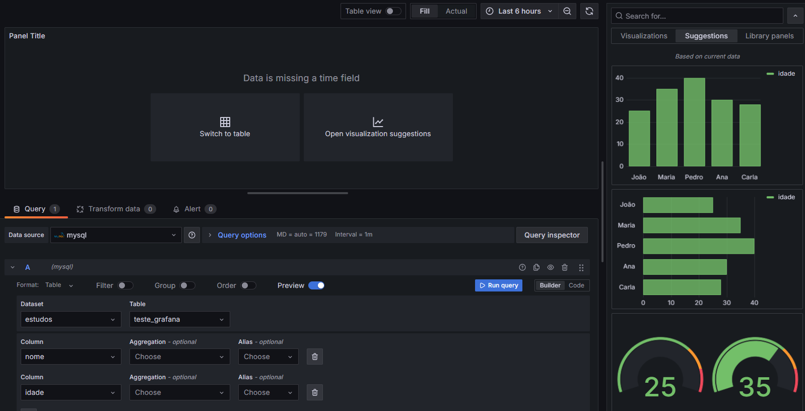

Existe uma variedade de opções de gráficos, então tudo vai depender do planejamento do que for melhor de ver os dados.

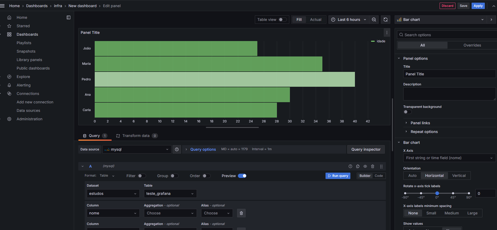

Para atualizar os painéis a cada x tempo, é só ir na aba de Dashboards e no sinal de reload escolher o tempo.

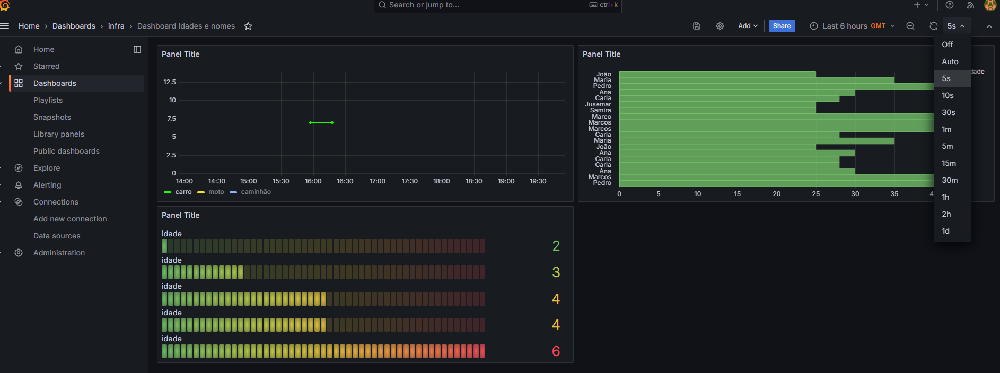

# Variáveis

É possível criar variáveis na aba de Dashboards, indo em Settings -> Variables. 

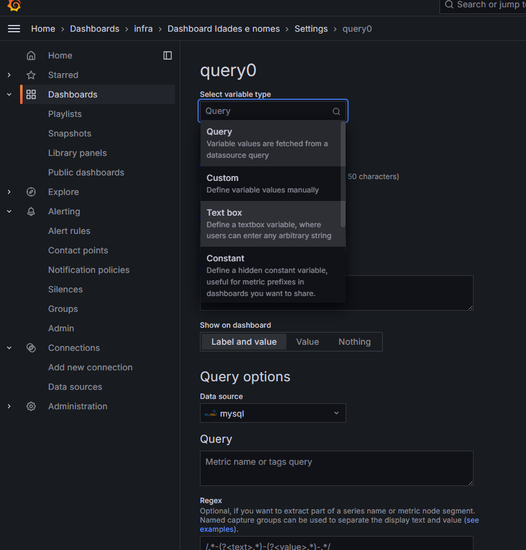

1. Variável Query - define uma query que irá trazer a visualização somente do resultado da variável.

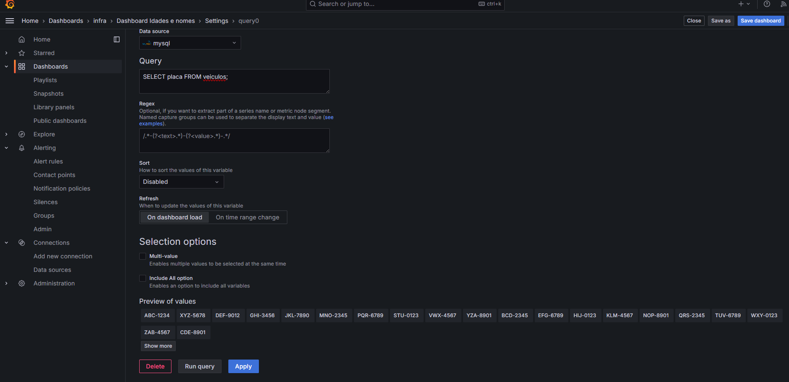

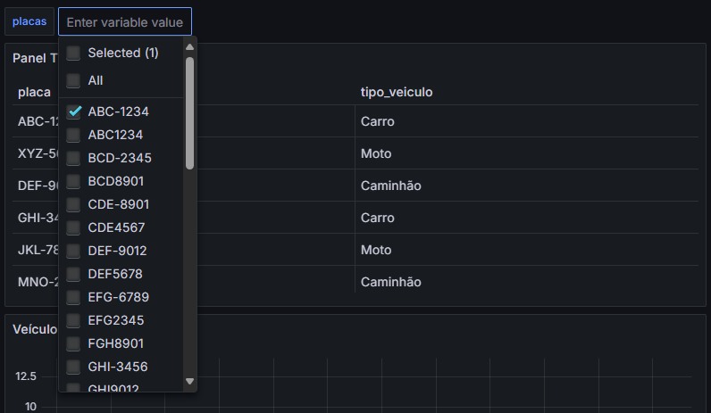

2. Variável Custom - colocar os textos que a gente quer que o Grafana consulte, dessa forma é possível fazer filtro usando essa variável. 

# Grafana CLI

- Acessando o caminho ``C:\Program Files\GrafanaLabs\grafana\bin`` é possível usar o CLI
- Para parar o Grafana é necessário abrir o PowerShell/CMD como adm e usar ``net stop grafana`` dentro do caminho acima
- Para iniciar o Grafana é ``net start grafana``
- Como alterar a senha do admin: ``grafana-cli admin reset-admin-password <NOVA_SENHA>``

# Compartilhamento de Painéis e Dashboards

## Painéis: 

É possível compartilhar as visualizações entre painéis, adicionando ele a uma library, exemplo:
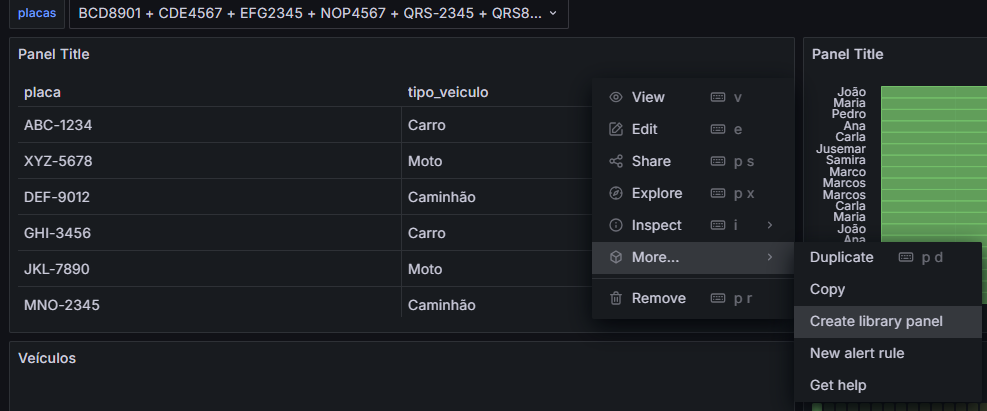

Feito isso, o painel ficará disponível para ser reutilizado em outras dashboards, podendo ser encontrado na aba "Library panels".

Basta criar uma nova Dashboard e ir em "Add a library panel", e assim adicionar o painel em questão.

## Dashboards:

É possível compartilhar a dashboard por link ou através de exportação, indo em "Share".

Para exportar: 
1. Vá na aba "Export"
2. Seleciona "Export for sharing externally"
3. Clica em "Save to file"

Depois de salvar, vai em "Dashboards" -> "New" -> "Import" -> Seleciona o arquivo em JSON, cola ou passa a URL. 

  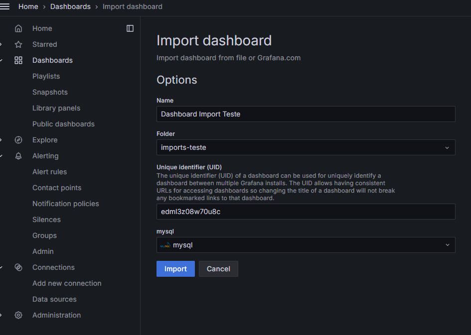
     
<em>Importando a Dashboard via JSON file</em>

